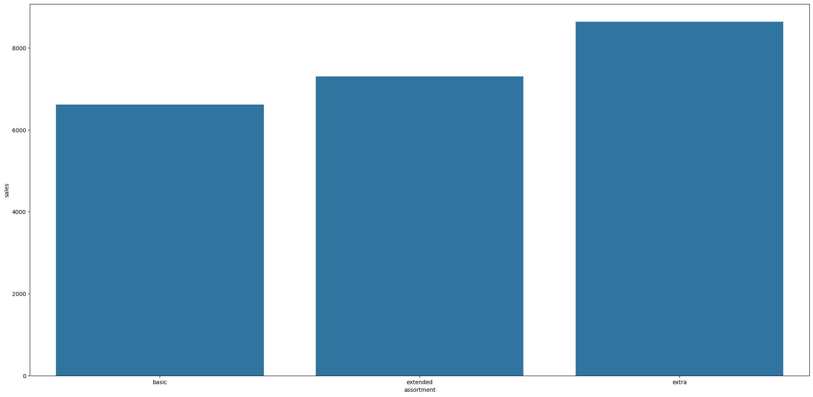
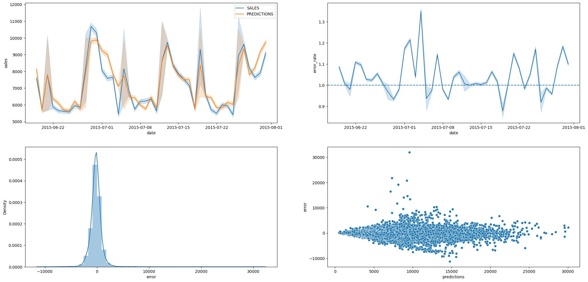

# Projeto Previsão de Vendas Rossmann 
Repositório para o projeto fictício de previsão de vendas feito na Comunidade DS utilizando dados do Kaggle.

## 1.Problema de negócio
A Rossmann opera mais de 3.000 drogarias em 7 países europeus. Atualmente, os gerentes de loja da Rossmann têm a tarefa de prever suas vendas diárias com até seis semanas de antecedência. As vendas das lojas são influenciadas por muitos fatores, incluindo promoções, concorrência, feriados escolares e estaduais, sazonalidade e localização. Com milhares de gerentes individuais prevendo vendas com base em suas circunstâncias únicas, a precisão dos resultados pode ser bastante variada.

O objetivo do projeto é a previsão de vendas de cada loja da Rossmann em 6 semanas.

## 2.Premissas assumidas para análise
- Os dados foram utilizados foram obtidos pelo link https://www.kaggle.com/c/rossmann-store-sales/data
- O período dos dados são de 2013 até 2015.
- As últimas 6 semanas foram utilizadas como dados de teste.
- Lojas sem informações sobre competidores próximos tiveram a distância fixada em 200.000 metros.
- A previsão considerará apenas as lojas que tiveram vendas superiores a 0 nos dados disponíveis.
- Os dias em que as lojas estiveram fechadas foram excluídos da previsão.

## 3.Estratégia de solução
### 3.1. Processo
Para garantir uma entrega rápida e eficiente da primeira solução, com o objetivo de trazer valor para a empresa e permitir decisões ágeis, foi adotado o método CRISP-DM. 
Este método é composto por 9 etapas cíclicas, em que aprimoramos o resultado de negócio a cada iteração dessas etapas. Buscamos entregas cada vez mais rápidas, de maior qualidade e com maior precisão. Isso possibilita que as equipes que utilizarão os resultados desenvolvidos tenham um produto minimamente utilizável já na primeira entrega, que será aprimorado ao longo do tempo.

### 3.2. Produto Final
- Modelo de ML para realizar previsões de vendas para as próximas 6 semanas por loja em tempo real.
- Formato da entrega: Valor abosluto de vendas nas próximas 6 semanas.
- Local de entrega: Bot no Telegram

### 3.3. Ferramentas Utilizadas
Para criar a solução, foram utilizadas as seguintes ferramentas:

- Python versão 3.10.1.
- Versionador de código Git.
- Jupyter Notebook. 
- Serviço de Hospedagem em Nuvem.
- Técnicas de manipulação de dados.
- Técnicas de redução de dimensionalidade e seleção de atributos.
- Algoritmos de Machine Learning da biblioteca scikit-learn do Python.

## 4.Top 3 insights de dados
### 1 - Lojas com maior sortimento vendem mais

### 2 - Lojas vendem mais ao longo dos anos

### 3 - Lojas tendem a vender mais no 2°semestre

## 5. Performance do modelo
No modelo final utilizamos a técnica de XBoost Regressor por ter apresentado os melhores resultados dentro os algoritmos utilizados, sendo eles: Linear Regression, Linear Regression Lasso, Random Forest e XGboost Regressor. Abaixo podemos as métricas de erro resultantes:
|	   Model Name     |	  MAE      |  	MAPE   |	  RMSE      |
| :---------------: | ---------: | --------: | -----------: |
|	XGBoost Regressor |	748.300968 |	0.117877 |	1109.374243 |

A seguir podemos ver o resultado gráfico do nosso modelo assim como os valores previstos para as vendas

| Scenario       |	Values           |
| :------------- | ----------------: |
| predictions    |	$298,779,424.00 |
|	worst_scenario |	$297,940,565.52 |
|	best_scenario  |	$299,618,285.15 |

## 6. Bot no Telegram
Criamos um bot no telegram que nos dá a previsão de 6 semanas da loja que quisermos encontrar. Caso queira testar basta procurar por este perfil: t.me/rossmann36_bot

## 7.Conclusão
Conseguimos realizar a previsão de vendas com sucesso. Apesar de ser um primeiro ciclo, o resultado já poderá ser utilizado para a análise do negócio.

## 8.Próximos passos

- Realizar novo ciclo do CRISP
- Gerar mais insigths
- Melhorar feature selection
- Melhorar métricas
